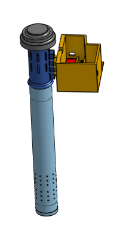

# 
  ⚙️MODELADO 3D🖋️

# 
  📑TABLA DE COMPONENTES🔖

  

---

# 
VISUALIZACIÓN GENERAL

El dispositivo del proyecto preliminar ganador se basa en dos conceptos. En primer lugar, tenemos el que cumple el rol de transmitir, compuesto por sensores, batería, NRF24L01 (módulo transceptor), Arduino Uno y otros elementos. En segundo lugar, el que cumple el rol de recepción, compuesta por el módulo ESP32, NRF24L01, batería y una caja que los contiene.

A continuación, se mostrará de manera general dichos elementos:

<table>
  <tr>
    <td></td>
    <td></td>
  </tr>
</table>

***Figura:*** 
Dispositivo 1 al lado izquierdo 
(Rol: transmisión, sensores) y Dispositivo 2 al lado derecho 
(Rol: recepción, enviar datos a la nube).

Vista completa de las dos componentes en:
* [sketchfab](https://sketchfab.com/3d-models/my-model-composite-part-4-eb2148cdebaa42dea660bec73f28d02b)
* [repositorio](../../Hadware/Modelo_3D/Dispositivos.stl)

## *MODELO 3D DEL DISPOSITIVO CON SENSORES Y DE LA CAJA CENTRAL:*

En estos links podrá visualizar nuestro dispositivo modo 3D: 

1. SKETCHFAB

* [Vista general 3D dispositivo #1](https://sketchfab.com/3d-models/all_my_model-8b4fa2704f744f1584f49b39e792a4b6)

* [Vista general 3D dispositivo #2 ](https://sketchfab.com/3d-models/caja-57ac736d35504cfc9fb07908c0be9ef0)

2. RESPOSITORIO

* [Vista general 3D dispositivo #1](../../Hadware/Modelo_3D/All_my_model.stl)

* [Vista general 3D dispositivo #2 ](../../Hadware/Modelo_3D/Caja_central.stl)

Del mismo modo, se puede visualizar sus componentes en SKETCHFAB:

* [Partes_dispositivo #1](https://sketchfab.com/3d-models/partes-mod-transmitir-f4738ec27411411494a5f1bcfd55df45)

* [Partes_dispositivo #2](https://sketchfab.com/3d-models/caja-908515660f7c4651aa6e702cc1981599)

O también puede visualizar las componentes desde nuestro repositorio: 

* [Componentes dispositivo #1](../../Hadware/Modelo_3D/Partes_mod_transmitir.stl)

* [Componentes dispositivo #2](../../Hadware/Modelo_3D/Caja_central.stl)

Finalmente, se presenta una breve representación de la ubicación donde se instalarán nuestros dispositivos en el entorno. 

