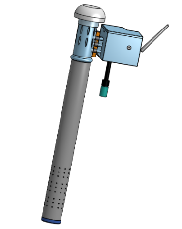

# 
  ⚙️MODELADO 3D🖋️

# 
  📑TABLA DE COMPONENTES🔖

  

En el presente link accederán a la presentación gráfica en la plataforma Onshape que nos servirá de representación visual sobre el proyecto ganador en el transcurso de nuestro proyecto.

*[Presentacion 3D en ONSHAPE](https://cad.onshape.com/documents/7a7f94140b8d86c7ea033ef1/w/e999b315eef8267ad934f188/e/f1a4476c1995a1daba91e3d9?renderMode=0&uiState=65c060436ad2e72b4ab15472)

*[Presentacion 3D en SKETCHFAB](link)

*Perspectiva de CON NUMERACIÓN[imagen]
# 
VISUALIZACIÓN GENERAL

El dispositivo del proyecto preliminar ganador se basa en dos conceptos. En primer lugar, tenemos el que cumple el rol de transmitir, compuesto por sensores, batería, NRF24L01 (módulo transceptor), Arduino Uno y otros elementos. En segundo lugar, el que cumple el rol de recepción, compuesta por el módulo ESP32, NRF24L01, batería y una caja que los contiene.

A continuación, se mostrará de manera general dichos elementos:

<table>
  <tr>
    <td>Rol: transmición, senso.</td>
    <td>Rol: recepción, enviar datos a la nube. </td>
  </tr>
</table>