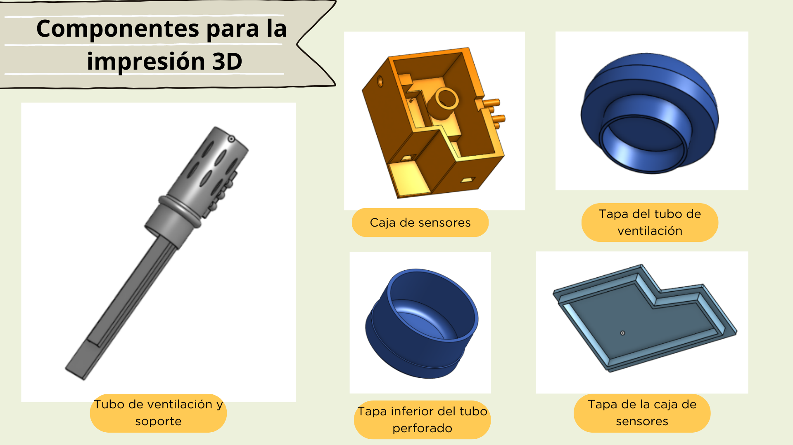
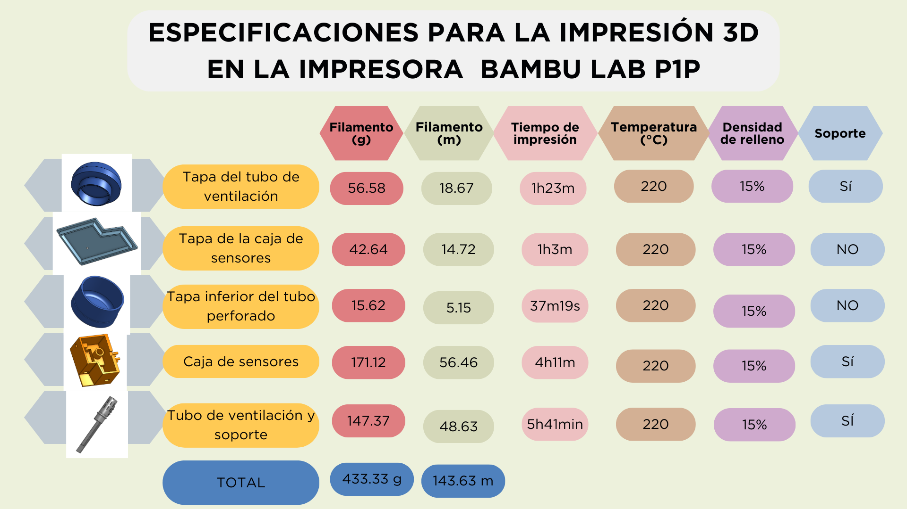

# 
 PLANOS DE FABRICACIÓN.🖋️⚙️

  En este entragable se han desarrollado diversos tipos de planos, especificando las medidas y la escala empleada en su 
  representación gráfica.
 

## 
PLANO GENERAL DEL MÓDULO CON SENSORES📏

[ONSHAPE](https://cad.onshape.com/documents/abdf9a93153ae0cff690ce01/w/0f25dce1825e5c7b0e513c2e/e/e05ece0ddaee348aff5f31f4)

## 
PLANO DE LA CAJA DEL SENSOR DE PH📏

[ONSHAPE](https://cad.onshape.com/documents/abdf9a93153ae0cff690ce01/w/0f25dce1825e5c7b0e513c2e/e/41b6131b445da347f293c4ef)

## 
 PLANO DE LA TAPA DEL TUBO, PARTE INFERIOR📏

.png)

[ONSHAPE](https://cad.onshape.com/documents/abdf9a93153ae0cff690ce01/w/0f25dce1825e5c7b0e513c2e/e/bebfb8ad76fc56d8f09fcbac)

## 
PLANO DE LA TAPA DE LA CAJA DEL SENSOR DE PH📏

.png)

[ONSHAPE](https://cad.onshape.com/documents/abdf9a93153ae0cff690ce01/w/0f25dce1825e5c7b0e513c2e/e/7b0b3b625309eafb34d392a6)

## 
PLANO DE LA TAPA DEL TUBO, PARTE SUPERIOR📏

[ONSHAPE](https://cad.onshape.com/documents/abdf9a93153ae0cff690ce01/w/0f25dce1825e5c7b0e513c2e/e/75290495f1c6b86d3eabc5a4)

## 
PLANO DEL TUBO📏

[ONSHAPE](https://cad.onshape.com/documents/abdf9a93153ae0cff690ce01/w/0f25dce1825e5c7b0e513c2e/e/806d9a40f8296d692cbd69cf)

## 
PLANO DEL SOPORTE DEL SENSOR DE CO2📏

[ONSHAPE](https://cad.onshape.com/documents/abdf9a93153ae0cff690ce01/w/0f25dce1825e5c7b0e513c2e/e/a92f1a1f2a5849794e21781a)

# 
PLANO DE LA CAJA CENTRAL

[ONSHAPE](https://cad.onshape.com/documents/7a7f94140b8d86c7ea033ef1/w/e999b315eef8267ad934f188/e/3a5b9aa109ccecf3491c6d49)

# 
PLANO PARA CORTE LÁSER

[DOCUMENTO_CORTE_LÁSER](https://github.com/Fx2048/Team_4_FdD/blob/main/Hadware/Prototipado/BOXCENTRAL.pdf)

En el siguiente enlace se utilizó el software online www.festi.info/boxes.py para la elaboración de la plantilla de la caja central.

[Software](https://www.festi.info/boxes.py/IntegratedHingeBox?FingerJoint_angle=90.0&FingerJoint_style=rectangular&FingerJoint_surroundingspaces=2.0&FingerJoint_bottom_lip=0.0&FingerJoint_edge_width=1.0&FingerJoint_extra_length=0.0&FingerJoint_finger=2.0&FingerJoint_play=0.0&FingerJoint_space=2.0&FingerJoint_width=1.0&ChestHinge_finger_joints_on_box=0&ChestHinge_finger_joints_on_lid=0&ChestHinge_hinge_strength=1.0&ChestHinge_pin_height=2.0&ChestHinge_play=0.1&x=170.0&y=170.0&h=60.0&outside=0&outside=1&lidheight=20.0&thickness=3.0&format=svg&tabs=0.0&qr_code=0&debug=0&labels=0&labels=1&reference=100&inner_corners=loop&burn=0.1&language=None&render=1)

[Gcode archivo caja central](https://github.com/Fx2048/Team_4_FdD/blob/main/Software/GCODE_ARCHIVOCENTRALBOX.gcode)

# 
COMPONENTES PARA LA IMPRESIÓN 3D

Para llevar a cabo la impresión 3D de nuestras componentes, se tomaron en cuenta las siguientes configuraciones en el programa Bambu_Studio, puesto que permite simular la impresión 3D y proporcionar información valiosa del seguimiento de dichas impresiones.

Se hizo lo siguiente:

+ Ajustes des sistema: Bambu Lab P1P 0.4 boquilla. 
+ Tipo de cama: alta temperatura de la placa.
+ Filamento: bambu PLA básico.
+ Altura de la capa: 1.7mm

# 
ARCHIVOS PARA LA IMPRESIÓN 3D

+ [Tapa del tubo de ventilación](../../Hadware/Modelo_3D/Tapa_tubo_ventilacion_PLA_1h23m.gcode) 
+ [Tapa inferior del tubo perforado](../../Hadware/Modelo_3D/Tapa_inferior_tubo_PLA_37m19s.gcode) 