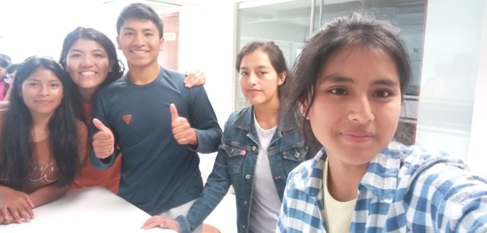

# INVESTIGACIÓN SOBRE EL EMPLEO DE PESTICIDAS EN LA AGRICULTURA- TEAM4_FdD-2024-V

Bienvenidos al repositorio del Grupo 4 del curso: "Fundamentos de Diseño"

## Proyecto: EL EMPLEO DE LOS PESTICIDAS EN LA AGRICULTURA
Se buscará analizar las situaciones donde se emplea los pesticidas como mecanismo de producción en la agricultura y el impacto en el ambiente.

Los pesticidas, también conocidos como plaguicidas, son sustancias o mezclas destinadas a prevenir o combatir plagas, ya sean plantas no deseadas, animales indeseados o ectoparásitos como pulgas y garrapatas, durante diversas etapas de la producción y distribución de productos agrícolas.

Los herbicidas son productos específicos utilizados para eliminar las llamadas "malas hierbas", interfiriendo en su crecimiento y desarrollo.

Por último, los biocidas son sustancias químicas, ya sean naturales o sintéticas, así como microorganismos, que se emplean para prevenir, contrarrestar o neutralizar organismos considerados perjudiciales para la salud pública y la agricultura. Esto abarca plagas como malas hierbas, insectos, ácaros, moluscos, roedores, hongos y bacterias. En resumen, los biocidas son una categoría amplia que engloba diversos tipos de sustancias utilizadas para controlar organismos no deseados en diferentes contextos.

# El trasfondo de la composición química de los productos antiplagas para el sector agrícola
# Tabla de Contenidos
1. Cambio periódico de cultivos
2. Restricciones en la aplicación de productos químicos y sintéticos
3. Prohibición de organismos genéticamente modificados (OGM)
4. Utilización de recursos locales
5. Selección de variedades adaptadas y resistentes
  
## Cambio periódico de cultivos:
Contenido del título 1.

## Restricciones en la aplicación de productos químicos y sintéticos
Contenido del título 2.

## Prohibición de organismos genéticamente modificados (OGM)
Contenido del título 3.

## Utilización de recursos locales
Contenido del título 4.

## Selección de variedades adaptadas y resistentes
Contenido del título 5.

### LOS PESTICIDAS EN EL CAMPO Y EL AMBIENTE
[¿Puede la agricultura ecológica alimentar al mundo?](https://www.ecoagricultor.com/agricultura-ecologica-organica-medioambiente/).

## Grupo 4
| Participantes | Estado | Contacto | Correo |
| --- | --- | --- | ---|
| BERNAL BELISARIO BRIGITTE | Colaborador | Fx2048 | Brigitte.bernal@upch.pe |
| TURPO HUAMAN NILDA MARIBEL | Colaborador | NILDAMARIBEL | Nilda.turpo@upch.pe |
| LUQUE MAMANI MAGNO RICARDO | Colaborador | Magno-Luque | Magno.luque@upch.pe |
| LLANOS ANGELES LEILY MARLITH | Colaborador | Marlith08 | Leily.llanos@upch.pe |
| QUISPE BALDEON MELISSA | Colaborador | MeliQB | Melissa.quispe.b@upch.pe |

